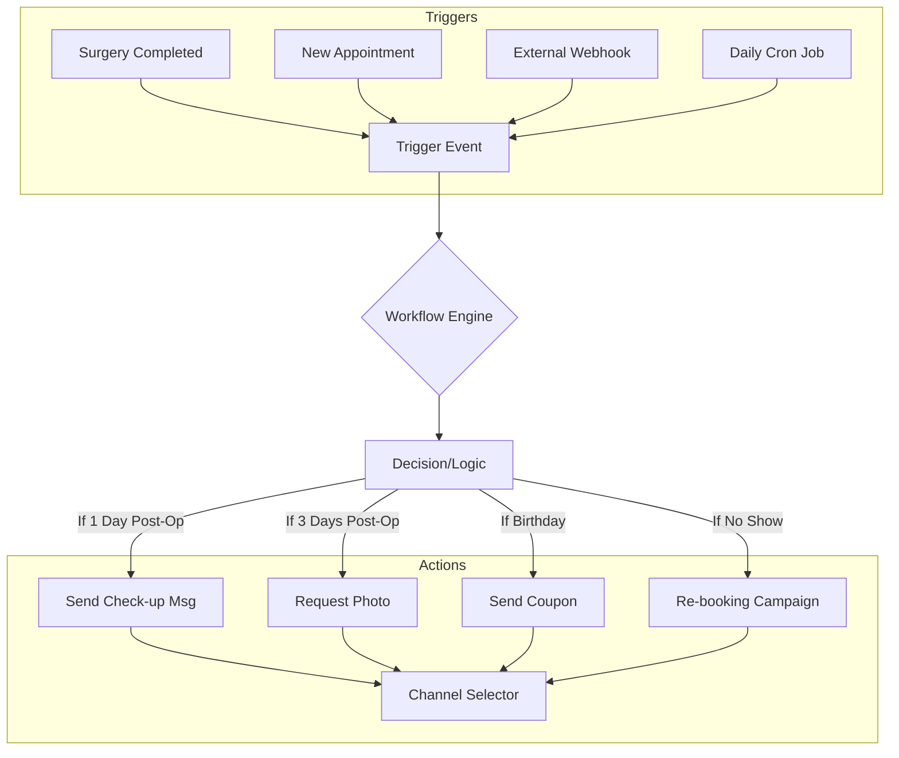
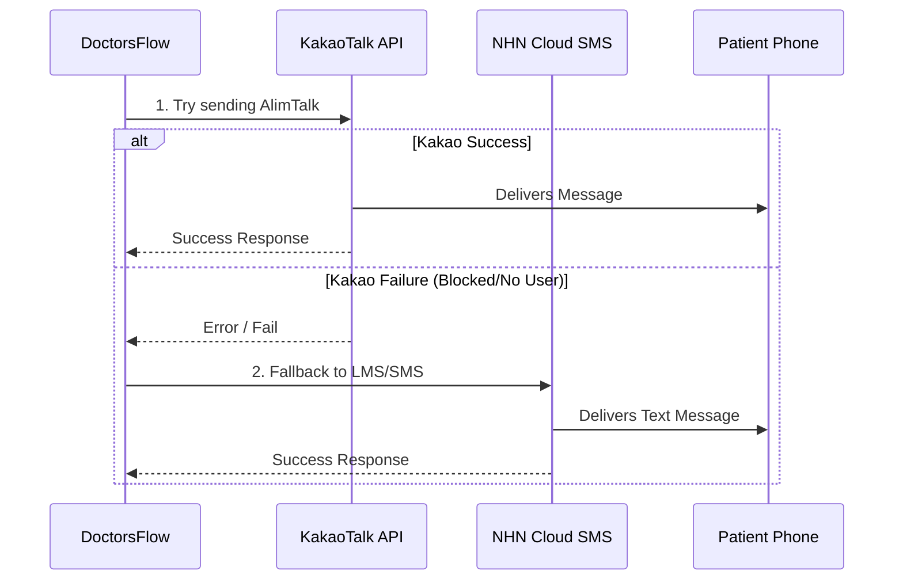
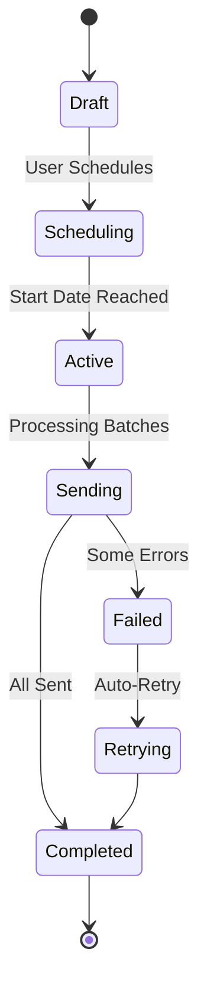
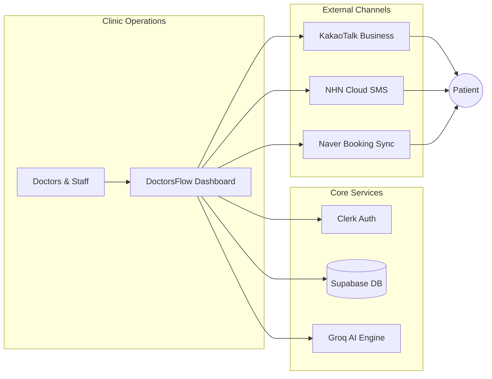
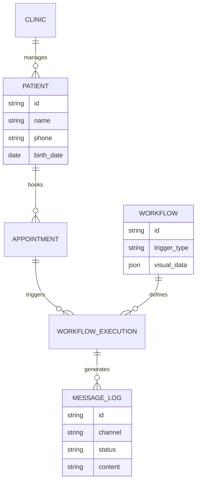
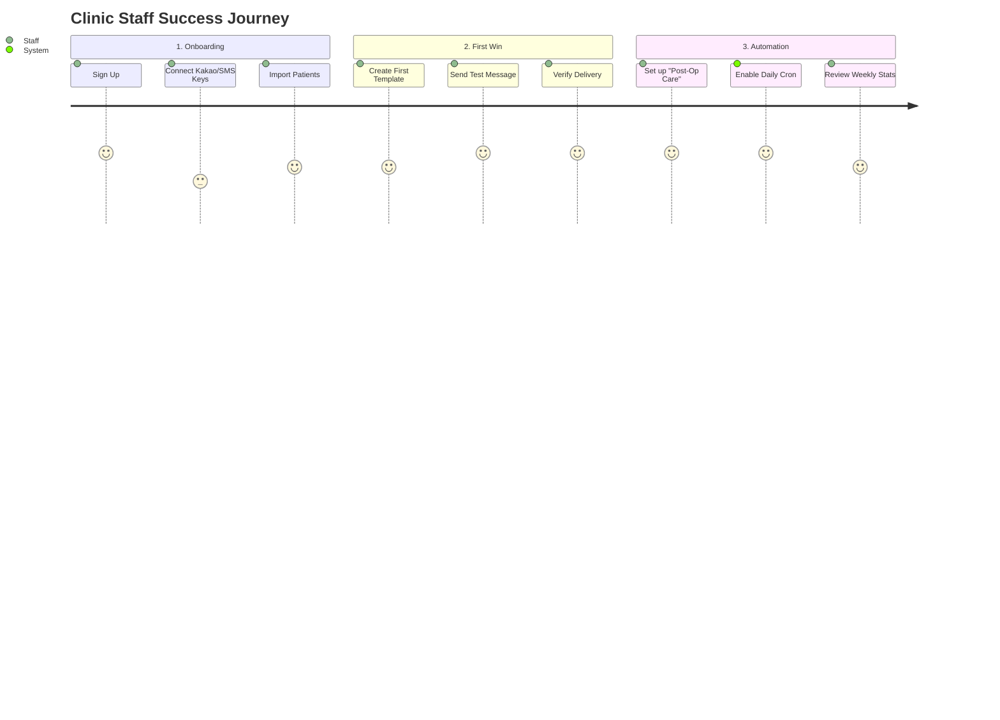

# 🗺️ THE BIG PICTURE: DoctorsFlow (닥터스플로우) Strategic Roadmap

This document outlines the high-level vision, architecture, and flow of the **DoctorsFlow** platform. It connects the dots between Automation, Marketing, Korean Localization, and User Success.

---

## 🏗️ 1. The Core: Automation Engine (The Brain)
*Automating patient care journeys so doctors can focus on treatment.*

The system is built around **Workflows** that trigger based on patient events (Appointments, Surgery Dates).

### 🔄 The Automation Flow

### 🛠️ Key Automation Features
- **Visual Builder**: n8n-style drag-and-drop interface for creating complex flows.
- **Smart Delays**: "Wait 3 days", "Wait until 10 AM next day".
- **Conditionals**: "If patient had LASIK" vs "If patient had LASEK".
- **Reliability**: Automatic retries for failed messages, detailed execution logs.

---

## 📢 2. Marketing & Communication (The Voice)
*Delivering the right message, at the right time, in the right channel.*

We focus on the **Korean Market** ecosystem, prioritizing KakaoTalk with SMS fallbacks.

### 📉 Smart Failover Strategy

### 🇰🇷 Korean Localization Strategy
1.  **KakaoTalk First**: The primary channel. High engagement, rich media support.
    *   *AlimTalk* (Informational)
    *   *FriendTalk* (Marketing)
2.  **SMS/LMS Fallback**: Used via **NHN Cloud** when Kakao delivery fails or user blocks the channel.
3.  **AI Copywriter (Groq/Llama)**:
    *   Generates friendly, polite Korean marketing copy.
    *   **Compliance Filter**: Automatically removes prohibited medical terms (e.g., "guaranteed cure", "best").

### 📈 Campaign Lifecycle

---

## 🖥️ 3. The Dashboard (The Command Center)
*A unified interface for doctors and staff to manage everything.*

The dashboard connects the data (Patients) with the actions (Workflows).

### 🌐 Ecosystem View

### 📊 Data Architecture Entity Map

---

## 🎓 4. User Success & Training ("Train")
*Empowering clinic staff to use the tool effectively.*

We don't just build software; we build a system that staff can learn easily.

### 🗺️ User Journey Map

### 📚 Onboarding & Training Pillars
1.  **Interactive Onboarding**:
    *   Step-by-step wizard for setting up API keys (Kakao, NHN).
    *   "First Message" tutorial.
2.  **Template Library**:
    *   Pre-built "Best Practice" workflows for common specialties (Ophthalmology, Plastic Surgery, Dermatology).
    *   *Example*: "Standard Cataract Surgery Recovery Path".
3.  **Documentation**:
    *   Clear guides on obtaining business licenses for Kakao.
    *   Video tutorials (future).

---

## 🚀 5. Future Roadmap: The "Bigger" Picture

Where we go from here to dominate the market.

1.  **AI Agents**: Instead of just static templates, AI agents that can reply to basic patient queries via Kakao.
2.  **Payment Integration**: Collect deposits or consultation fees directly via link (PortOne).
3.  **EMR/CRM Deep Integration**: Two-way sync with major Korean EMRs so manual entry is zero.
4.  **Advanced Analytics**: ROI tracking per campaign (Did the patient book after the message?).

---

### 🔗 Quick Links to Deep Dives
- **Architecture**: `BACKEND_ARCHITECTURE.md`
- **User Flows**: `USER_FLOW_DOCUMENTATION.md`
- **Automation Details**: `WORKFLOW_AUTOMATION_FEATURES.md`
- **Next Steps**: `NEXT_STEPS.md`
