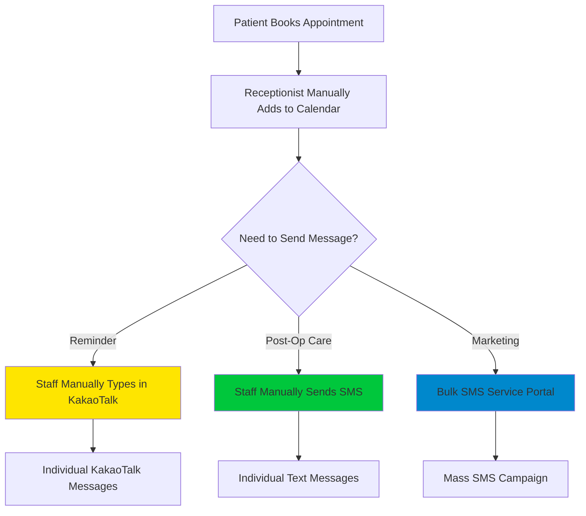

# 🏥 Korean Private Medical Clinic Industry: The Reality (2024-2025)

**Real-world infrastructure, APIs, laws, and practices for private 개인병원/의원**

This document details how Korean private medical clinics (particularly ophthalmology and plastic surgery) actually operate today—not academic theory, but practical reality.

---

## 🏗️ 1. The Technology Stack Reality

### EMR/CRM Systems Actually Used
Private Korean clinics typically use one of these EMR systems:

1. **비즈엠 차트 (BizM Chart)** - Most popular for small-medium clinics
2. **메디플러스 (MediPlus)** - Common in specialized clinics
3. **모두의원 (Modu Clinic)** - Popular for ophthalmology
4. **아이엠원 (IMOne)** - Used by aesthetic clinics
5. **차트온 (ChartOn)** - Growing among new clinics

**API Reality Check:**
- ❌ **Most EMR systems do NOT provide public APIs**
- ❌ **No standardized healthcare data exchange format**
- ❌ **Data export usually limited to Excel/CSV manual export**
- ⚠️ **Some systems charge extra fees for "API access" (if available)**

**What This Means for DoctorsFlow:**
- You CANNOT automatically sync with EMR systems
- Clinics will need to **manually input patient data** OR
- Use **CSV import** features for bulk patient upload
- Future integration would require direct partnerships with EMR vendors

---

## 📱 2. Patient Communication: The Actual Flow

### Current Practice (How Clinics Do It Now)

**Pain Points Clinics Face:**
- 🔴 **Receptionist spends 2-3 hours/day manually sending messages**
- 🔴 **Easy to forget post-op follow-ups (Day 1, 3, 7)**
- 🔴 **No tracking of who received messages**
- 🔴 **Expensive: Bulk SMS costs ₩20-30 per message**
- 🔴 **No personalization (just generic "Dear patient...")**

---

## 🔐 3. Legal & Compliance Framework

### A. Personal Information Protection Act (PIPA) 개인정보보호법

**What It Means for You:**

✅ **Required:**
- Explicit patient consent BEFORE collecting phone/email
- Consent form must explain EXACTLY what data is used for
- Separate consent needed for marketing vs. treatment messages
- Data must be encrypted at rest and in transit
- Appoint a Data Protection Officer (DPO) if handling >1000 patients
- Breach notification within **72 hours**

❌ **Prohibited:**
- Sharing patient data with 3rd parties without explicit consent
- Using patient data for purposes not disclosed during consent
- Retaining data longer than necessary (must delete after purpose fulfilled)

**Penalties:**
- Up to ₩50 million fine
- Criminal prosecution for serious violations
- Civil lawsuits from affected patients

---

### B. Medical Service Act 의료법

**Medical Advertising Restrictions:**

❌ **Absolutely Prohibited:**
- Claims of "best", "guaranteed", "100% success rate"
- Before/after photos without consent + watermark
- Comparison with other clinics
- Patient testimonials (verbal or written)
- Exaggerated efficacy claims
- Discount/coupon promotion (some exceptions for non-medical services)

✅ **Allowed:**
- Factual information (clinic hours, location, doctor credentials)
- Procedure descriptions (without efficacy claims)
- General health tips
- Appointment booking links

**Review Process:**
- All marketing materials must be submitted to **Korean Medical Advertising Review Association (KMAA)**
- Review takes 5-10 business days
- Approval certificate must be kept on file

**Penalties:**
- ₩10 million fine per violation
- Possible clinic license suspension (serious/repeated violations)

---

### C. KakaoTalk AlimTalk Specific Rules

**AlimTalk (알림톡)** = Informational messages

✅ **Allowed Use Cases:**
- Appointment confirmations
- Appointment reminders
- Post-surgery care instructions
- Billing/payment confirmations
- Test result notifications

❌ **NOT Allowed:**
- Promotional/marketing content
- New service announcements
- Event invitations
- Discount offers

**FriendTalk (친구톡)** = Marketing messages

✅ **Allowed IF:**
- Patient has explicitly opted-in to marketing
- Patient has "added your clinic as a KakaoTalk friend"
- Message includes easy opt-out option
- Compliance with Medical Service Act advertising rules

**Technical Reality:**
- AlimTalk requires **Kakao Business Account** (₩300k-500k setup + monthly fees)
- Must use approved message templates (Kakao reviews each template)
- Template approval takes 1-3 days per submission
- Templates CANNOT be modified after approval (must resubmit)

---

## 📬 4. SMS/LMS Service Providers

### Major Players

1. **NHN Cloud (former Toast Cloud)**
   - Most reliable for healthcare
   - API-first platform
   - Good documentation
   - Cost: ~₩8-12 per SMS, ₩30-40 per LMS
   
2. **Coolsms (쿨에스엠에스)**
   - Popular with small clinics
   - Easy integration
   - Slightly cheaper
   - Cost: ~₩7-10 per SMS, ₩25-35 per LMS

3. **Bizppurio (비즈뿌리오)**
   - Enterprise-focused
   - Supports AlimTalk + SMS in one platform
   - More expensive but feature-rich

**Real API Availability:**
✅ All major SMS providers have **excellent REST APIs**
✅ Well-documented with code examples
✅ Webhook support for delivery reports
✅ No special approvals needed for API access

---

## 📅 5. Naver Booking Integration Reality

### The Harsh Truth

❌ **Naver does NOT provide a public API for booking data**
❌ **No official way to sync appointments**
❌ **Naver's terms of service prohibit automated scraping**

**How Clinics Currently Handle It:**
1. Receptionist logs into Naver Booking portal daily
2. Manually checks new/updated appointments
3. Copies data into clinic's EMR system
4. Updates status after patient visit

**What DoctorsFlow Does (Clever Workaround):**
- Chrome Extension installed on clinic PC
- Extension monitors Naver Booking page DOM changes
- Captures new appointment data when receptionist views it
- Auto-sends to DoctorsFlow via secure webhook
- ⚠️ **Technically in gray area, but widely used by clinic management tools**

**Alternatives:**
- Patients can book directly through DoctorsFlow website
- Integrate with Kakao Channel booking (better API support)
- Use Google Calendar API for appointment management

---

## 🔄 6. The MyData Initiative (2024 Update)

**What Is It?**
Government program allowing patients to:
- Request all their medical records in digital format
- Transfer records between hospitals
- Revoke data access at any time

**Current Status:**
- Mandatory for all healthcare institutions as of 2025
- Patients get unique **Digital Health ID**
- Data must be accessible via government portal

**Impact on DoctorsFlow:**
- Must provide patient data export feature
- Patients can request deletion of all data
- Need clear consent flow showing what data is stored

---

## 💰 7. Cost Structure Reality

### What Clinics Actually Pay

**Current Manual Process:**
- Receptionist salary: ₩2.5-3M/month
- Time spent on messaging: ~40 hours/month
- SMS costs: ₩500k-1M/month (varies by clinic size)
- Lost revenue from missed follow-ups: ₩5-10M/month estimated

**DoctorsFlow Value Proposition:**
- Save 30-40 hours/month of receptionist time
- 100% delivery rate (Kakao → SMS failover)
- Reduce SMS costs by 30-50% (using Kakao first)
- Increase post-op appointment attendance by 20-30%
- ROI payback in 2-3 months

**Pricing Strategy (Competitive Landscape):**
- Basic EMR: ₩50k-100k/month
- Marketing automation tools: ₩100k-300k/month
- **DoctorsFlow sweet spot: ₩150k-200k/month**

---

## 🎯 8. How DoctorsFlow Fits In

### Positioning Strategy

**NOT Competing With:**
- ❌ EMR systems (they're entrenched, hard to replace)
- ❌ Naver Booking (clinics must use it for visibility)

**Complementing Existing Tools:**
- ✅ "Smart Layer" on top of existing EMR
- ✅ Automates communication workflows they do manually
- ✅ Fills the gap between EMR and patient engagement

### The Sales Pitch to Clinics

> *"You don't need to change your EMR. DoctorsFlow connects to your existing systems and automates the time-consuming tasks your staff does manually—sending appointment reminders, post-op care messages, and marketing campaigns. Save 40+ hours/month while improving patient satisfaction and attendance rates."*

---

## 🚀 9. Competitive Landscape

### Who Else Is Doing This?

**Direct Competitors:**
1. **굿닥 (GoodDoc)** - Patient booking + basic CRM
2. **닥터나우 (Doctor Now)** - Telemedicine focus, expanding to clinic management
3. **메디히어 (MediHere)** - Appointment booking platform

**What They're Missing (DoctorsFlow's Edge):**
- ❌ No visual workflow builder
- ❌ No smart Kakao → SMS failover
- ❌ No post-op care automation
- ❌ Generic, not specialized for ophthalmology/plastic surgery

---

## 📋 10. Immediate Action Items for DoctorsFlow

### Must-Have Features for Launch

1. **Compliance:**
   - [ ] PIPA-compliant consent forms (Korean + English)
   - [ ] Data export feature (JSON/CSV)
   - [ ] Patient data deletion tool
   - [ ] Privacy policy generator

2. **Integration:**
   - [ ] NHN Cloud SMS API integration
   - [ ] Coolsms API integration
   - [ ] Kakao AlimTalk integration (business account setup guide)
   - [ ] CSV import for patient data (since no EMR APIs)

3. **Templates:**
   - [ ] Pre-approved AlimTalk templates library
   - [ ] Medical advertising-compliant message templates
   - [ ] Specialty-specific workflows (cataract surgery, LASIK, rhinoplasty, etc.)

4. **Documentation:**
   - [ ] API key setup guide (Korean)
   - [ ] Legal compliance checklist
   - [ ] KMAA advertising review submission guide
   - [ ] Sample consent forms

---

## 📚 References

- **PIPA**: [Personal Information Protection Commission](https://www.pipc.go.kr)
- **Medical Service Act**: [Ministry of Health & Welfare](https://www.mohw.go.kr)
- **KMAA**: [Korean Medical Advertising Association](https://www.kmaa.or.kr)
- **NHN Cloud**: [SMS API Documentation](https://docs.nhncloud.com/en/Notification/SMS/en/Overview/)
- **Coolsms**: [API Documentation](https://docs.coolsms.co.kr/)

---

## 💡 Key Takeaway

**Korean private clinics are stuck in manual, time-consuming processes because:**
1. EMR systems don't offer APIs or automation
2. Legal restrictions make marketing complex
3. Staff lack technical knowledge to use automation tools
4. Existing solutions are generic, not healthcare-specific

**DoctorsFlow wins by:**
- Being specialized for medical clinics
- Making compliance easy (built-in templates)
- Providing visual, no-code automation
- Focusing on time-saving and ROI

---

*Document Version: 1.0 | Last Updated: Nov 26, 2024*

